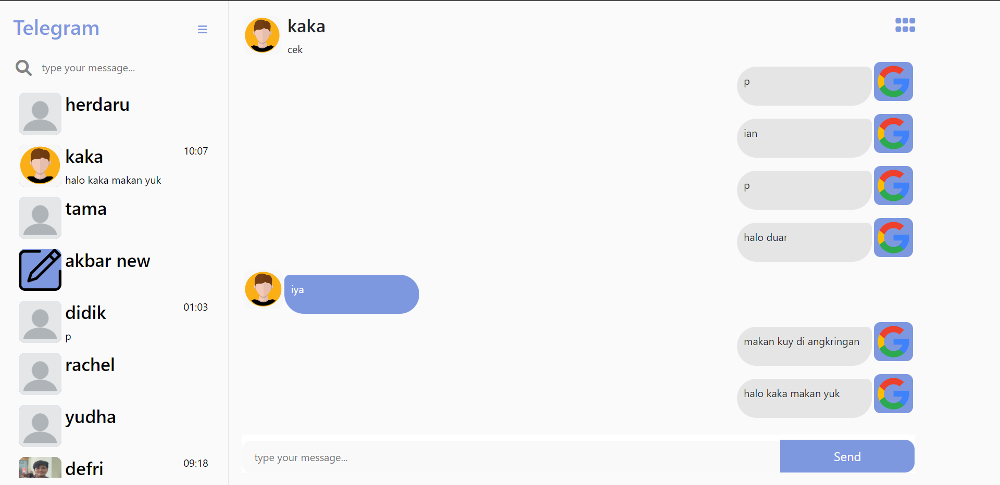

<div id="top"></div>


<!-- PROJECT LOGO -->
<br />
<div align="center">
  <a href="https://github.com/rikakus/Telegram-FE">
    
  </a>

<h3 align="center">TELEGRAM</h3>
</div>


<!-- TABLE OF CONTENTS -->
<details>
  <summary>Table of Contents</summary>
  <ol>
    <li>
      <a href="#about-the-project">About The Project</a>
      <ul>
        <li><a href="#built-with">Built With</a></li>
      </ul>
    </li>
    <li>
      <a href="#getting-started">Getting Started</a>
      <ul>
        <li><a href="#installation">Installation</a></li>
      </ul>
    </li>
    <li><a href="#usage">Usage</a></li>
    <li><a href="#license">License</a></li>
    <li><a href="#contact">Contact</a></li>
  </ol>
</details>


<!-- ABOUT THE PROJECT -->
## About The Project


Telegram is a real-time chat website developed with the ReactJS framework and Socket technology where users can register, login, search for other usernames, chat with other users in real time, and edit their own profiles.

<p align="right">(<a href="#top">back to top</a>)</p>


### Built With

* [React.js](https://reactjs.org/)
* [Bootstrap](https://getbootstrap.com)

<p align="right">(<a href="#top">back to top</a>)</p>


<!-- GETTING STARTED -->
## Getting Started

This is an example of how you may give instructions on setting up your project locally.
To get a local copy up and running follow these simple example steps.

### Installation

1. Get the API from my github at [https://github.com/rikakus/Telegram-BE](https://github.com/rikakus/Telegram-BE)
2. Clone the repo
   ```sh
   git clone https://github.com/rikakus/Telegram-FE
   ```
3. Install NPM packages
   ```sh
   npm install
   ```
4. Enter your API in `.env`
   ```js
   REACT_APP_BACKEND_URL= where you run the API
   ```

<p align="right">(<a href="#top">back to top</a>)</p>


<!-- USAGE EXAMPLES -->
## Usage


### Landing Page



### Login


### Edit Profile


### Profile another user


<p align="right">(<a href="#top">back to top</a>)</p>


<!-- LICENSE -->
## License

Distributed under the MIT License. See `LICENSE.txt` for more information.

<p align="right">(<a href="#top">back to top</a>)</p>


<!-- CONTACT -->
## Contact

Ian Pangestu - [@ianpangestu082](https://twitter.com/ianpangestu082) - ianpangestu082@gmail.com

Project Link: [https://telegram-rikakus.vercel.app](https://telegram-rikakus.vercel.app)

Link API:  [https://github.com/rikakus/Telegram-BE](https://github.com/rikakus/Telegram-BE)

<p align="right">(<a href="#top">back to top</a>)</p>
